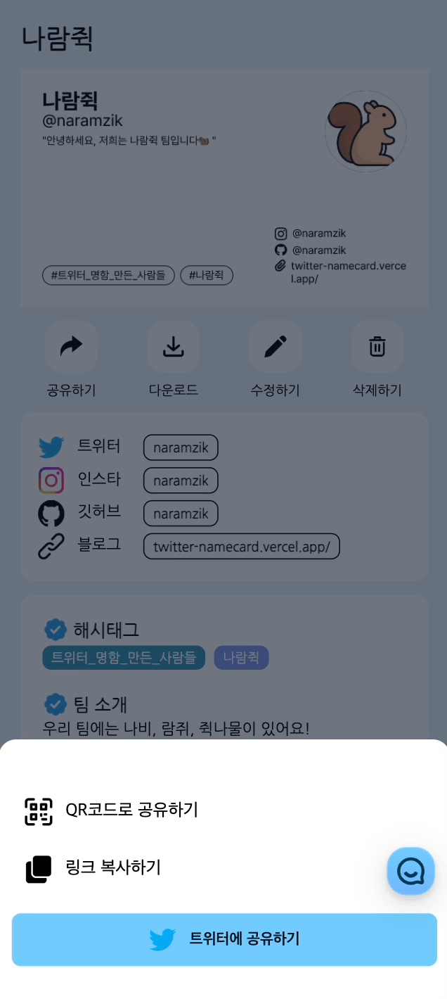

# 트위터 명함

<b>나만의 트위터 명함 만들기🐥 
</b>나만의 트위터 명함을 만들고 QR코드, 이미지, URL 등으로 공유해보아요. 

👉 배포 주소: https://twitter-namecard.vercel.app/
 
📢 서비스 운영: https://twitter.com/naramzik
 
🔮 피드백&문의: https://naramzik.channel.io

 

 

# 🤝 팀 소개

<table align="center" style="width: 100%;">
    <tr align="center">
        <td style="width: 50%;">
            <b>김나비</b>
             
            <b style='font-size:12px'>풀스택</b>
             
            
             
            <a href="https://github.com/nabi-chan">https://github.com/nabi-chan</a>    
        </td>
        <td style="width: 50%;">
            <b>이영경</b>
             
            <b style='font-size:12px'>백엔드</b>
             
            
             
            <a href="https://github.com/cottonpup">https://github.com/cottonpup</a>
        </td>
        <td style="width: 50%;">
            <b>이지선</b>
             
            <b style='font-size:12px'>프론트</b>
             
            
             
            <a href="https://github.com/biyamn">https://github.com/biyamn</a>
        </td>
</table>

 

# 🛠️ 프론트엔드 기술 스택

<table>
<tr>
 <td align="center">언어</td>
 <td>
  
 </td>
</tr>
<tr>
 <td align="center">프레임워크</td>
 <td>
  
 </td>
</tr>
<tr>
 <td align="center">라이브러리</td>
 <td>
  &nbsp
  &nbsp
  &nbsp
 </td>
</tr>
<tr>
 <td align="center">CSS 프레임워크</td>
 <td>
  &nbsp
  &nbsp
 </td>
</tr>
<tr>
 <td align="center">패키지</td>
 <td>
    
  </td>
</tr>
<tr>
 <td align="center">포맷터 및 린터</td>
 <td>
  &nbsp 
  &nbsp 
  &nbsp 
 </td>
</tr>
</table>

 

# 🛠️ 백엔드 기술 스택

<table>
<tr>
 <td align="center">언어</td>
 <td>
  
 </td>
</tr>
<tr>
 <td align="center">프레임워크</td>
 <td>
  
 </td>
</tr>
<tr>
 <td align="center">데이터 관리 및 요청</td>
 <td>
  &nbsp
  &nbsp
 </td>
</tr>
<tr>
 <td align="center">웹 크롤링</td>
 <td>
   &nbsp
 </td>
</tr>
<tr>
 <td align="center">데이터베이스 관리</td>
 <td>
     
  </td>
</tr>
<tr>
 <td align="center">ORM</td>
 <td>
     
 </td>
</tr>
</table>

 

# 프로젝트 주요 기능 소개

<table align="center">
  <tr align="center">
    <td>명함 생성</td>
    <td>동작</td>
  </tr>
  <tr>
    <td align="center">
      <b>트위터 아이디를 검색하여 트위터 정보를 불러오고</b>
       
      <b>트위터 프로필, 타 SNS 정보, 해시태그 등을 입력하여</b>
       
      <b>명함을 생성할 수 있습니다.</b>
    </td>
    <td align="center">
      
    </td>
  </tr>
  <tr align="center">
    <td>명함 공유 - QR코드, 링크 복사하기</td>
    <td>동작</td>
  </tr>
  <tr>
    <td align="center">
     <b>QR코드로 공유하거나, 링크를 복사하여 공유할 수 있습니다.</b>
      
     <b>트윗으로 바로 공유할 수도 있습니다.</b>
       
     <b></b>
    </td>
    <td align="center">
      
    </td>
  </tr>
  <tr align="center">
    <td>명함 공유 - 트윗으로 공유하기</td>
    <td>동작</td>
  </tr>
  <tr>
    <td align="center">
     <b>트윗으로 링크를 바로 공유할 수 있습니다.</b>
       
     <b>이때 공유할 명함을 썸네일로 미리 볼 수 있습니다.</b>
      
    </td>
    <td align="center">
      
    </td>
  </tr>
  <tr align="center">
    <td>명함 모아보기</td>
    <td>동작</td>
  </tr>
  <tr align="center">
    <td>
     <b>다른 사람들이 만든 명함들을 확인할 수 있습니다. </b>
       
    </td>
    <td align="center">
      
    </td>
  </tr>
  <tr align="center">
    <td>명함 검색</td>
    <td>동작</td>
  </tr>
  <tr align="center">
    <td>
     <b>명함을 검색할 수 있습니다.</b>
       
    </td>
    <td align="center">
      
    </td>
  </tr>
</table>
