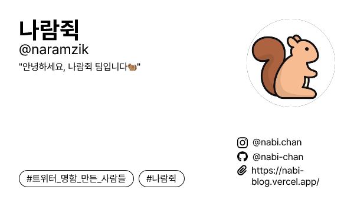

<div align='center'>

# 트위터 명함



<b>나만의 트위터 명함 만들기🐥<br/>
</b>나만의 트위터 명함을 만들고 QR코드, 이미지, URL 등으로 공유해보아요.<br />

👉 배포 주소: https://twitter-namecard.vercel.app/

<br/>

</div>

<div >

<br/>

# 🤝 팀 소개

<table align="center" style="width: 100%;">
    <tr align="center">
        <td style="width: 50%;">
            <b>김나비</b>
            <br/>
            <b style='font-size:12px'>풀스택</b>
            <br/>
            
            <br/>
            <a href="https://github.com/nabi-chan">https://github.com/nabi-chan</a>    
        </td>
        <td style="width: 50%;">
            <b>이영경</b>
            <br/>
            <b style='font-size:12px'>백엔드</b>
            <br/>
            
            <br/>
            <a href="https://github.com/cottonpup">https://github.com/cottonpup</a>
        </td>
        <td style="width: 50%;">
            <b>이지선</b>
            <br/>
            <b style='font-size:12px'>프론트</b>
            <br/>
            
            <br/>
            <a href="https://github.com/biyamn">https://github.com/biyamn</a>
        </td>
    <!-- </tr>
    <tr align="center">
        <td style="width: 50%;">
            한 번 시작한 일은 절대 포기하지 않아요😊
            <br/>
            <b>Springboot</b>, <b>Mybatis</b>, <b>Mysql</b>, <b>JPA</b> 경험이 있으며 현재 JPA를 공부 중 입니다!!
            <br/>
            <br/>
            <b>[담당기능]</b>
            <br/>
            - sns 로그인
            <br/>
            - 사용자 초대에 관련 API
        </td>
        <td style="width: 50%;">
            개발을 좋아하고 문제 해결이 재밌어요!
            <br />
            <br/>
            <b>[담당기능]</b>
            <br/>
            - Refresh token
            <br/>
            - 로그아웃
            <br/>
            - 질문, 답변 관련 API
            <br/>
            - 배포
        </td>
        <td style="width: 50%;">
            컴포넌트화, 모듈화, 클래스화를 좋아합니다.
            <br/>
            <br/>
            <b>[담당기능]</b>
            <br/>
            - 온보딩 ui 구현
            <br/>
            - 카카오 소셜 로그인 
            <br/>
            - 레이아웃 구현
        </td>
    </tr> -->
</table>

<br/>

# 🛠️ 프론트엔드 기술 스택

<table>
<tr>
 <td align="center">언어</td>
 <td>
  
 </td>
</tr>
<tr>
 <td align="center">프레임워크</td>
 <td>
  
 </td>
</tr>
<tr>
 <td align="center">라이브러리</td>
 <td>
  &nbsp
  &nbsp
  &nbsp
 </td>
</tr>
<tr>
 <td align="center">CSS 프레임워크</td>
 <td>
  &nbsp
  &nbsp
 </td>
</tr>
<tr>
 <td align="center">패키지</td>
 <td>
    
  </td>
</tr>
<tr>
 <td align="center">포맷터 및 린터</td>
 <td>
  &nbsp 
  &nbsp 
  &nbsp 
 </td>
</tr>
</table>

<br/>

# 🛠️ 백엔드 기술 스택

<table>
<tr>
 <td align="center">언어</td>
 <td>
  
 </td>
</tr>
<tr>
 <td align="center">프레임워크</td>
 <td>
  
 </td>
</tr>
<tr>
 <td align="center">라이브러리</td>
 <td>
  &nbsp
 </td>
</tr>
<tr>
 <td align="center">CSS 프레임워크</td>
 <td>
  &nbsp
 </td>
</tr>
<tr>
 <td align="center">패키지</td>
 <td>
    
  </td>
</tr>
<tr>
 <td align="center">포맷터 및 린터</td>
 <td>
  &nbsp 
 </td>
</tr>
</table>

</br>

# 🙋 프로젝트 소개

### 기획 의도

### 프로젝트 설명

### 나중에 추가하고 싶은 기능

<br/>

# 프로젝트 주요 기능 소개

### 명함 생성하기

-

<!-- |  |  |
| :-------------------------------------------------------------------------------------------------: | :-----------------------------------------------------------------------------------------------: |
|                                             닉네임 입력                                             |                                           로딩 화면<br>                                           | -->

### 나의 명함 확인하기

-

<!-- |  |  |
| :-------------------------------------------------------------------------------------------------: | :-----------------------------------------------------------------------------------------------: |
|                                             닉네임 입력                                             |                                           로딩 화면<br>                                           | -->

### 명함 공유하기

-

<!-- - |  |  |
  | :---------------------------------------------------------------------------------------------------: | :-----------------------------------------------------------------------------------------------: |
  |                                     문항 선택후 다음 문제로 이동                                      |                                      문항 미선택시 알림<br>                                       | -->

### 트친들의 명함 둘러보기

-

<!-- |  |  |
| :-----------------------------------------------------------------------------------------------------------: | :-----------------------------------------------------------------------------------------------------: |
|                                              결과 페이지로 이동                                               |                                             결과 페이지<br>                                             | -->

<br/>

# 🚀 프로젝트 실행 방법

### 설치 및 실행

1. 프로젝트를 로컬 환경으로 복제합니다.

```shell
git clone https://github.com/ramgee-zzik-nabi/application
```

2. 프로젝트 루트 디렉토리에서 아래 명령어를 입력하여 의존성 패키지를 설치합니다.

```shell
$ yarn
```

3. 프로젝트 루트 디렉토리에 `.env` 파일을 생성하여 아래와 같이 변수를 설정합니다.

```

```

4. 프로젝트 루트 디렉토리에서 아래 명령어를 입력하여 프로젝트를 실행합니다.

```shell
$ yarn dev
```
